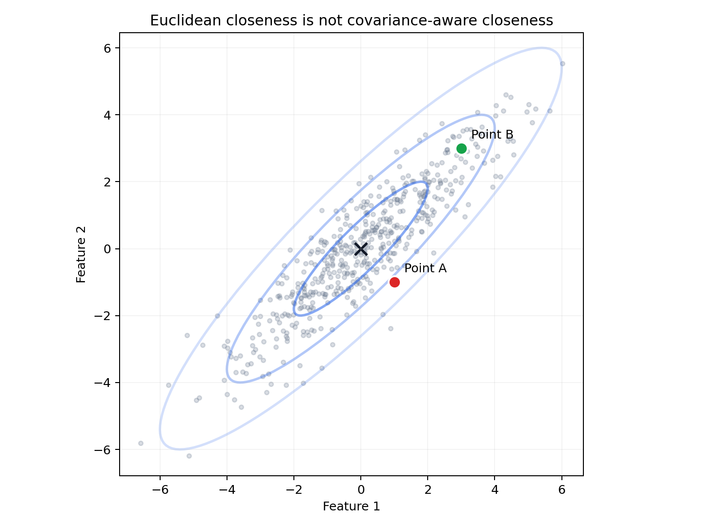
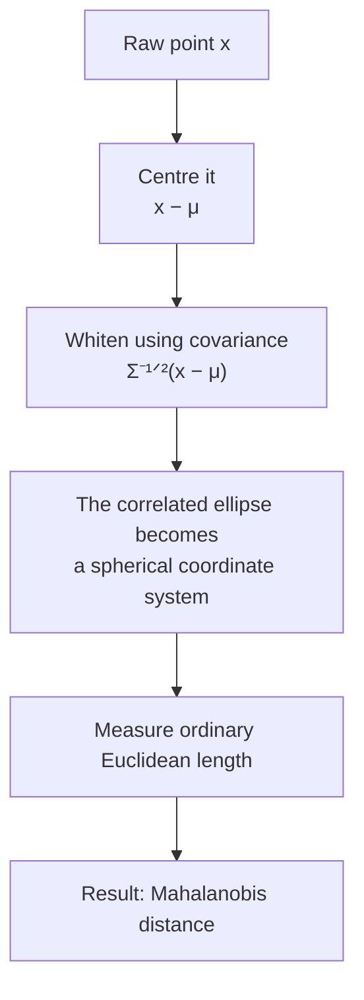
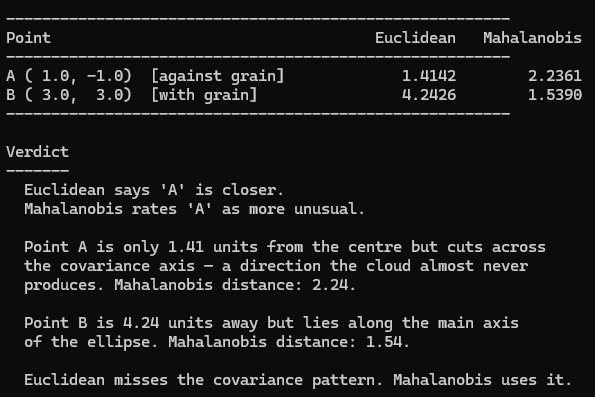

## TL;DR

- P. C. Mahalanobis framed a covariance-aware generalised distance in 1936, amid closely related contemporary work by Harold Hotelling.
- It measures distance after accounting for the directions in which the data naturally varies.
- The same quadratic form appears inside LDA, Gaussian mixtures, and multivariate anomaly detection, alongside priors and other probability terms.
- Under an exact multivariate normal model, its square has a chi-squared distribution; estimated or misspecified models need more care.
- In high dimensions, estimating and solving with the covariance matrix is the difficult part.

I wrote my undergraduate machine learning exam without once thinking about where the distance measure came from.

The exam had a question on distance metrics. I could recite the properties of Euclidean distance, L1, cosine similarity, and Mahalanobis distance in sequence, the formula, the covariance matrix, when you'd prefer it over Euclidean.

I never asked who Mahalanobis was, and the course never said.

The person got edited out, and I absorbed the implicit message that the idea arrived from nowhere in particular. Statistical distance arrived from somewhere in particular: Calcutta, 1936. A Bengali physicist who had spent years making statistics usable on a large scale.

His name was Prasanta Chandra Mahalanobis.

---

## The man before the formula

Mahalanobis was born in Calcutta on [29 June 1893](https://mathshistory.st-andrews.ac.uk/Biographies/Mahalanobis/). He studied at Presidency College, went to Cambridge to read mathematics and natural sciences, and came back to India in 1915 as a physics lecturer. The statistics came sideways, on a trip to England he stumbled across a bound volume of *Biometrika*, Karl Pearson's journal, and could not put it down.

There was no established Indian statistical institution or consistent national data infrastructure to plug into. He spent the 1920s building the prerequisites: methods for large-scale surveys, standards for agricultural sampling, techniques for estimating crop yields across a subcontinent with no central database.

In 1931 he founded the Indian Statistical Institute in Calcutta, growing out of the small Statistical Laboratory he had set up at Presidency College. Its journal *Sankhyā*, which he started in 1933, is still running. The ISI became an Institution of National Importance in 1959. [Indian Statistical Institute, official history](https://www2.isical.ac.in/~deanweb/GNRLRULES-REGULATIONS.pdf)

This is the context the 1936 paper comes from: a man who had spent a decade working with messy, real data at scale, and who had noticed a problem that the existing tools couldn't handle.

---

## What Euclidean distance gets wrong

The problem is easiest to see with a picture you can build in your head.

Imagine a cloud of data points: height and arm span, measured in centimetres, for a large population. The two dimensions are correlated, taller people tend to have longer arms. If you plot the cloud, it is not a circle. It is an ellipse, stretched diagonally.

Now take two new people and ask: which one is more unusual?

Person A is moderately above average on one measurement and moderately below average on the other. In raw terms, they sit reasonably close to the centre. But they cut across the direction of the cloud, where the population almost never goes. Their combination is unusual even though neither coordinate is extreme by itself.

Person B is much further above average on both measurements. They sit further from the centre in raw distance. But they lie *along* the main axis of the cloud, exactly the direction the data expects.

Euclidean distance will call Person A more normal because they are closer in raw units. A covariance-aware measure calls Person A more unusual because that combination cuts against the population pattern.



His 1936 paper, ["On the generalised distance in statistics," *Proceedings of the National Institute of Sciences of India*, Vol. 2, No. 1](https://doi.org/10.1007/s13171-019-00164-5), proposed a distance measure that accounts for the structure of the distribution itself.

---

## One formula, doing a lot of work

Before the formula, three pieces of notation:

- A **vector** is just an ordered list of measurements. For height and arm span, **x** might be `[180, 188]`.
- **μ** is the mean vector, the average value of each measurement.
- **Σ** is the covariance matrix. Its diagonal records how much each measurement varies; its off-diagonal entries record whether two measurements tend to rise and fall together.

The Mahalanobis distance from a point **x** to that distribution is:

$$
D_M(\mathbf{x}, \boldsymbol{\mu})
= \sqrt{(\mathbf{x}-\boldsymbol{\mu})^{\mathsf T}
\boldsymbol{\Sigma}^{-1}
(\mathbf{x}-\boldsymbol{\mu})}
$$

Read it from the inside out. Subtract **μ** to measure how far the point is from the centre. Multiply by **Σ⁻¹** to rescale and untangle the correlated directions. The superscript **T** turns the first vector sideways so the multiplication produces one number. The square root puts that number back on a distance scale.

The **Σ⁻¹** term, the inverse of the covariance matrix, is doing all the work. It makes movement along high-variance directions count less and movement along low-variance directions count more. Equivalently, you can whiten the data first, turning its tilted ellipse into a circle, and then use ordinary Euclidean distance. The formula knows the difference.



Three special cases help make it concrete.

**1. Identity covariance.** When **Σ = I** (ones down the diagonal and zeroes elsewhere), $D_M$ collapses exactly to Euclidean distance. Every dimension is independent and already on the same scale.

**2. Different scales, no correlation.** When **Σ** is diagonal but its variances differ, the formula becomes:

$$
D_M = \sqrt{\frac{(x_1-\mu_1)^2}{\sigma_1^2}
+ \frac{(x_2-\mu_2)^2}{\sigma_2^2} + \cdots}
$$

Each difference is measured in units of that feature's usual variation. A ten-centimetre deviation matters less for a feature that routinely varies by twenty centimetres than for one that varies by two.

**3. Correlated measurements.** The general case, with off-diagonal terms, rotates as well as rescales the coordinate system so the long and narrow directions of the data cloud are treated differently.

There is also a statistical interpretation that makes the distance genuinely useful: if **x** is drawn from a multivariate normal distribution $N(\boldsymbol{\mu}, \boldsymbol{\Sigma})$ and those population parameters are known, then $D_M(\mathbf{x})^2$ follows a chi-squared distribution with *d* degrees of freedom, where *d* is the number of measurements. A chi-squared table tells you how large a squared distance would be unusual under that model, which gives outlier detection a principled threshold. Once the mean and covariance are estimated from finite data, or the normal model is wrong, that calibration needs more care.

Don't worry about the matrix inversion for now. It's not a trivial computation; in high dimensions, inverting **Σ** costs O(d³) and requires enough data to estimate it reliably (you need more samples than dimensions, or the matrix becomes singular).

This is a real practical constraint in large-scale ML, and it's why people use diagonal approximations and low-rank tricks in practice.

---

## Where it lives in modern ML

It appears in a specific set of methods:

**Linear Discriminant Analysis (LDA)** is a classifier: given a new point, it decides which labelled group probably produced it. It scores the point using its Mahalanobis distance from each class mean under one shared covariance matrix, while also accounting for how common each class is. With equally common classes, this becomes nearest mean by Mahalanobis distance.

**Quadratic Discriminant Analysis (QDA)** gives each class its own covariance matrix. That allows differently shaped clouds, but the probability score must also account for the volume represented by each covariance matrix through its determinant. [Scikit-learn, "Linear and Quadratic Discriminant Analysis"](https://scikit-learn.org/stable/modules/lda_qda.html)

**Gaussian Mixture Models (GMMs)** treat a dataset as several overlapping bell-shaped clouds. The Expectation-Maximization algorithm, or EM, alternates between estimating which cloud probably owns each point and updating the clouds from those soft assignments. In its assignment step, squared Mahalanobis distance measures how well the point fits each cloud's shape, alongside the cloud's size and prevalence. The formula is present even when the name is not.

When I first worked through this in a probabilistic ML course, the connection was not mentioned. It was presented as "the EM algorithm updates soft assignments," with the formula given in exponential form. The Mahalanobis distance was invisible, present in the math and absent from the framing. That is the curriculum problem that bothers me more than the biographical one: we miss what the underlying structure actually is. (Not to mention that the class was one of the most underexplained and underdocumented courses I have ever taken.)

**Multivariate outlier detection** is the most direct application. Under a fitted multivariate Gaussian, you compute D_M for each new point and compare it with a reference threshold. When the model and parameter estimates are reliable, the chi-squared relationship gives that threshold a statistical interpretation. When they are not, it is a baseline, not an oracle.

I still find its persistence odd. We have spent ninety years adding neural layers, attention mechanisms, and billion-parameter models to the pile, and this old quadratic form remains a useful first comparison. The 1930s are inside the 2020s.

**Mahalanobis distance in neural networks:** a 2018 NeurIPS paper fitted class-conditional Gaussians to a network's learned features and used a Mahalanobis-based confidence score for out-of-distribution detection. The representation is learned; the quadratic form is still the old one. [Lee et al., NeurIPS 2018](https://proceedings.neurips.cc/paper_files/paper/2018/hash/abdeb6f575ac5c6676b747bca8d09cc2-Abstract.html)

---

## One small code demo

The Python script in `code/demo.py` makes the contrast concrete. It generates a 500-point cloud from a bivariate Gaussian with correlation 0.9, plots its covariance ellipses, and compares two test points using the known mean and covariance of that generating distribution:

- **Point A: (1.0, −1.0).** Raw Euclidean distance from centre: 1.41. Mahalanobis: 2.24.
- **Point B: (3.0, 3.0).** Raw Euclidean distance from centre: 4.24. Mahalanobis: 1.54.

Point A is physically closer to the centre. Mahalanobis rates it as more unusual because it sits in the direction the cloud rarely goes. Point B is three times further away in raw units but is consistent with a cloud that moves diagonally. Moderate coordinates can still form a strange combination.



## Get the code

[Download the demo ZIP](/blog/assets/code/the-distance-that-knows-how-the-data-moves/the-distance-that-knows-how-the-data-moves.zip) · [View source on GitHub](https://github.com/Sukalyan2003/Sukalyan2003.github.io/tree/main/blog/assets/code/the-distance-that-knows-how-the-data-moves)

The download includes the script, README, and tests, plus the demo dependencies. Extract it, open the extracted `the-distance-that-knows-how-the-data-moves` folder in a terminal, and run:

```bash
python3 -m pip install -r code/requirements.txt
python3 code/demo.py
```

See `code/README.md` for the test command.

The script also writes the ellipse plot used above. The formula is a few lines of NumPy. The insight behind it is ninety years old.

---

## The other thing he built

I have been writing about the distance, but Mahalanobis spent as much of his career on surveys as on the formula. In the 1930s and 1940s he developed methods for large-scale random sample surveys, optimum sampling design, pilot survey techniques, methods for estimating crop yields across a country that had no census infrastructure worth speaking of.

The National Sample Survey of India (NSS), launched in 1950, was built on this work. The methods influenced the International Statistical Institute's approach to survey methodology globally.

He also shaped India's Second Five-Year Plan (1956–1961). The "Mahalanobis model" prioritized heavy industry and capital goods over consumer goods and agriculture, arguing that building the capacity to make machines was the prerequisite for everything else. The plan's outcomes were mixed, industry grew, but agricultural pressure and consumer goods shortages were real.

His largest real-world application of statistics-to-planning produced contested results.

The Royal Society elected him a Fellow in 1945, two years before Partition and independence. India would later name [29 June as National Statistics Day](https://mospi.gov.in/national-statistics-day) in his honour.

---

## What doesn't fit

Mahalanobis was not an unambiguous computing pioneer.

The 1936 paper is statistics instead of computer science. The connection to ML is real but downstream. Mahalanobis was thinking about how to compare populations. The later applications are something that happened to his work.

Nor did the quadratic form appear in a vacuum. Harold Hotelling's 1931 T² statistic used closely related covariance-aware mathematics before Mahalanobis's generalised-distance paper. Mahalanobis's distinct contribution was to frame and develop the quantity explicitly as a distance between statistical populations. The history is concurrent work followed by a durable formulation. [Hotelling, "The Generalization of Student's Ratio," 1931](https://www.jstor.org/stable/2957535); [Mahalanobis, "On the Generalised Distance in Statistics," 1936 reprint](https://doi.org/10.1007/s13171-019-00164-5)

The formula assumes you can estimate the covariance matrix reliably. In high-dimensional ML, the empirical covariance can be singular or unstable.

Diagonal approximations, shrinkage estimators, and low-rank approximations are engineering responses to that gap. Mahalanobis proposed the distance for modest collections of measurements; a vision model with ten thousand features is a different numerical problem.

That is how a lot of statistics travels into ML. A formulation from the 1920s or 1930s shows up inside a modern method, with its assumptions covered by the abstraction layer above it. When the approximation fails, you are better placed if you know what the original assumption was.

---

## The thing to come back to

Mahalanobis is a case where the history is well-documented, he is not obscure, the paper has a clear citation trail, the ISI is a real institution with a real address in Kolkata, and yet I completed an ML module that used methods directly traceable to his 1936 paper and never knew exactly who he was.

The Mahalanobis in the Mahalanobis distance is just a random word, not a person.

That specific invisibility pattern is what this series is about. Not unknown history, rather known history that just did not travel as far as the method it produced.

The distance is scale-invariant and covariance-aware. The curriculum, it turns out, was neither.

---


Try changing the correlation in `code/demo.py` from 0 to 0.5, 0.9, and 0.99, then watch what happens to Point A. If you find a covariance matrix the validation mishandles, open an issue on the repository.

## Sources and further reading

- Mahalanobis, P. C. ["On the generalised distance in statistics"](https://doi.org/10.1007/s13171-019-00164-5). *Proceedings of the National Institute of Sciences of India*, Vol. 2, No. 1, pp. 49–55, 1936. Primary paper, linked through the 2018 *Sankhyā* reprint.
- Scikit-learn, ["Linear and Quadratic Discriminant Analysis"](https://scikit-learn.org/stable/modules/lda_qda.html). LDA and QDA likelihoods, priors, covariance determinants, and Mahalanobis interpretation.
- Lee, Kimin, et al. ["A Simple Unified Framework for Detecting Out-of-Distribution Samples and Adversarial Attacks"](https://proceedings.neurips.cc/paper_files/paper/2018/hash/abdeb6f575ac5c6676b747bca8d09cc2-Abstract.html). NeurIPS 2018.
- Indian Statistical Institute, [official history and regulations](https://www2.isical.ac.in/~deanweb/GNRLRULES-REGULATIONS.pdf).
- Ministry of Statistics, Government of India, [National Statistics Day](https://mospi.gov.in/national-statistics-day).
- MacTutor History of Mathematics, ["Prasanta Chandra Mahalanobis"](https://mathshistory.st-andrews.ac.uk/Biographies/Mahalanobis/).
- Hotelling, H. ["The Generalization of Student's Ratio"](https://www.jstor.org/stable/2957535). *Annals of Mathematical Statistics* 2(3): 360–378, 1931.
